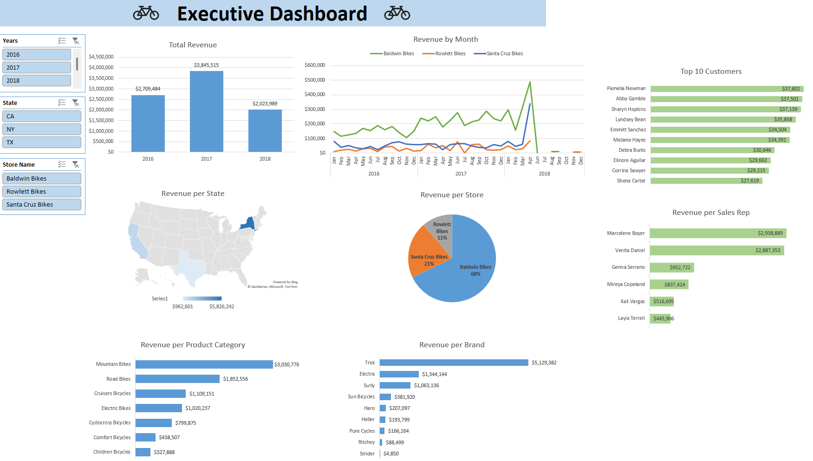
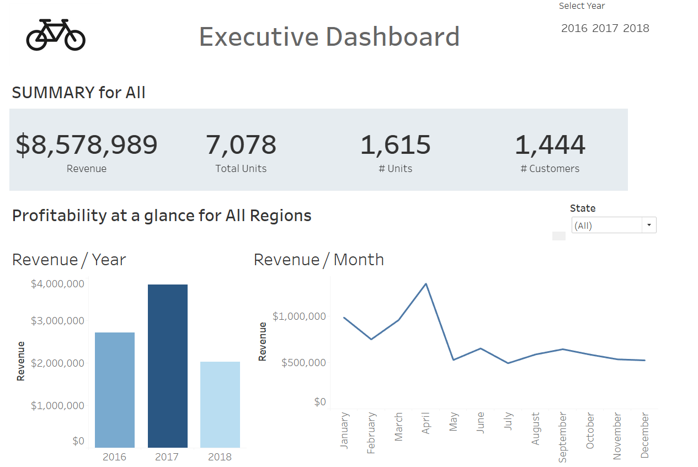
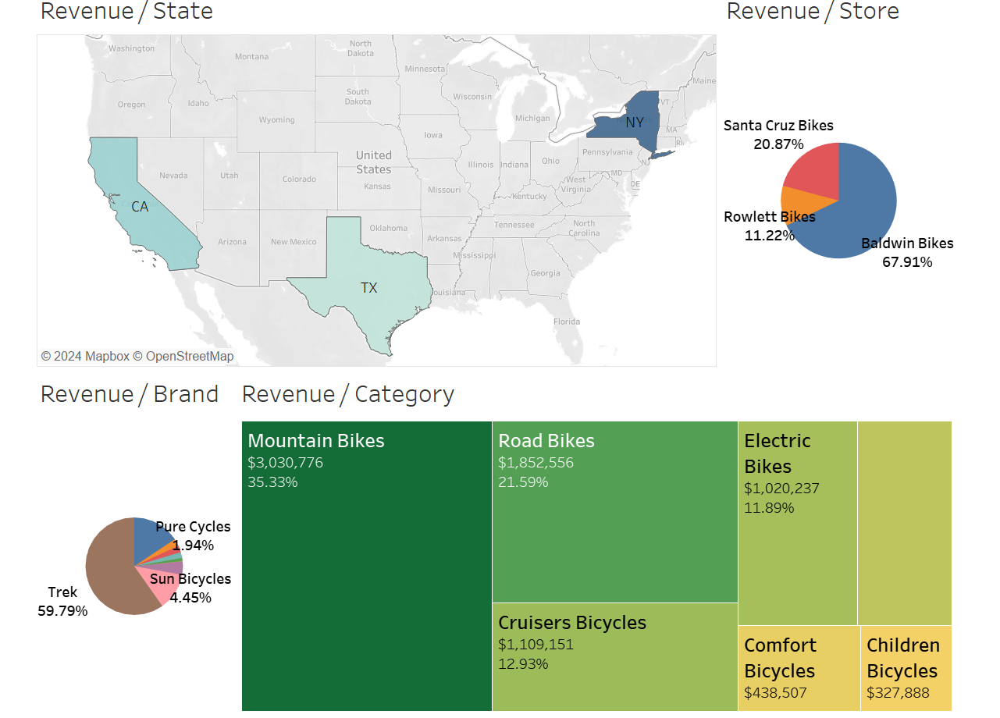
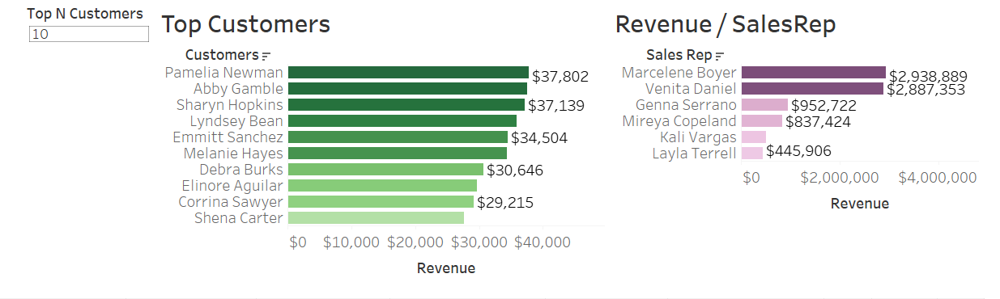

# BikeStores

### Tools
* Excel
* SQL Server / SQL Server Management Studio (SSMS)
* Tableau

### Skills Demonstrated
* Data Analysis Process:
    * Ask
    * Prepare
    * Process
    * Analyze
    * Share
* Data analysis using SQL and Excel
* Dynamic Dashboards in Tableau and Excel

### Datasets
* Both formats contain the same data, just pick whichever format you prefer to work in
    * [CSV](Data-Source/CSV/) - Raw data
    * [SQL](Data-Source/SQL/) - Raw data

### Business Task
* What are the conditions of the sales activities within the BikeStore company?
* Gain insights into the various trends happening in the sales volume over the 2016 - 2018 period

### Ask
* By asking questions that are Specific, Measurable, Action-Oriented, Relevant, and Time-bound we can answer the business task
    * Revenue per store?
    A list of top sales rep?
    * Revenue per product category?
    * Revenue per brand?
    * Revenue per region?
    * A list of top customers?

### Prepare
* Collect and gather the relevant data
* Validate data integrity
    * Data Source: First-party open data
* Understand table relationships
    * 
* Consolidate relevant data into one table
    * Combined data from 8 different tables

### Process
* Clean the data
    * Missing data
    * Erroneous values that may skew results
    * Duplicate data

### Analyze
* Analyze the data to solve the business task and gain data-driven insights
* [Solve the Business Task](Questions-and-Answers.md)

### Share
* Data visualization for comprehensive and dynamic dashboard
* Excel
    * 
    * 

---

* Tableau
    * [View Dashboard - CLICK HERE](https://public.tableau.com/app/profile/zohair.awan/viz/BikeStores_17193581764380/Dashboard)
    * 
    * 
    * 